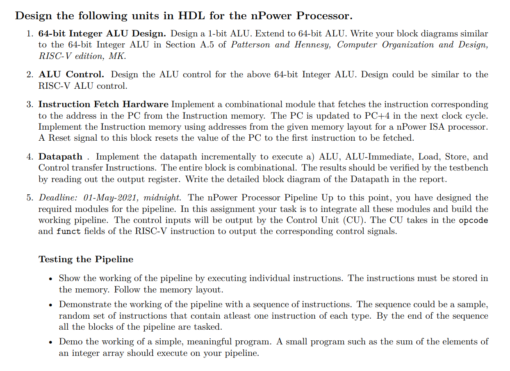

# Readme

> This directory is the submission for ***nPOWER ISA - 5 STAGE PIPELINED CPU SIMULATOR***

## The teammates for this submission are

* 191CS102 - Aakarshee Jain
* 191CS123 - Ikjot Singh Dhody
* ***191CS124 - Ishaan Singh***
* 191CS160 - Swapnil Guduru

---

## Where is our Project?
You can access the .tlv files at the following places.
* In the directory accompanying this readme file - ***nPOWER_simulation.tlv***
* View it directly in Makerchip - https://makerchip.com/sandbox/0mZf5hODv/0Wnh4L#

## Program Simulated by Instruction Set
Multiplication Tables of the number declared in `\TLV rf()` function - line 66.

## How to execute the program
* Change the number on line 66 to the number whose multiplicative tables are needed.
* Our instruction set will use that number and perform multiplication using an addition loop.
* The program terminates when the register holds the 10th multiple of the number you input.
* If the program and simulation was successful, the logs will report so, and viceversa.
* Use the waveform to see how the CPU updates the register values for register `\xreg[14]`.
* ***You need to change the input on line 66 and enter expected termination multiple on line 192.***

---

